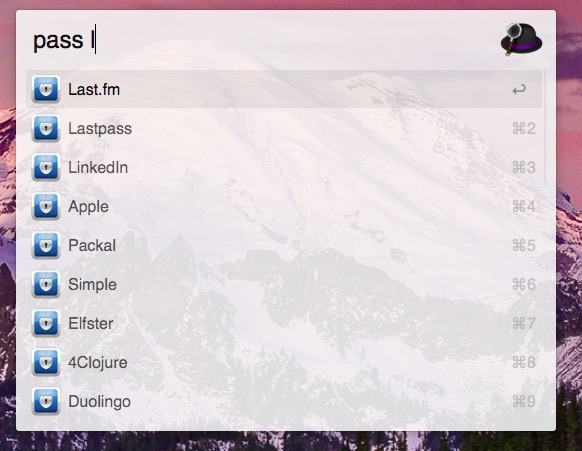
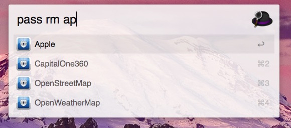
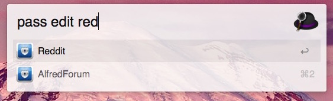

# pass

pass provides a thin wrapper around the pass password management tool for use with [Alfred (2 or 3)](http://alfredapp.com). Its intent is to make copying passwords while browsing the web quick and easy. It also supports the other functionality of pass, including password editing, generation, viewing, and git commands, all accomplished by passing through commands to the terminal. Will use iTerm (beta 3) by default. If you don't have this terminal, see below for how to use Terminal.app

## Install:

The recommended place to get pass is at [Packal](http://www.packal.org/workflow/pass). This will enable it to be updated in the future with the Packal workflow.

## Terminal.app
The workflow now supports Terminal.app as well. To use this, open the workflow in Alfred. In each `Run Script` bubble, change the word `execute_iterm3beta.scpt` to `execute_terminal.scpt`. Now the workflow will use Terminal.app.

## Keywords:

`pass`

This is the only keyword provided. However, the script called in the script filter handles some other keywords to provide autocomplete, including:

	pass git
	pass add
	pass rm

All the commands for pass are supported, and will be passed through to the terminal.

The default use case is as follows:

pass <pass-name>

This will search for a password of pass-name, autocompleting the results, then copy the result when it is selected.

## Requirements:

Must have pass, and its requirement, gpg. Also should already have a key, and have set up the .password-store directory. This is easiest with `brew install pass`, then follow the `instructions in man pass`

## Screenshots:

